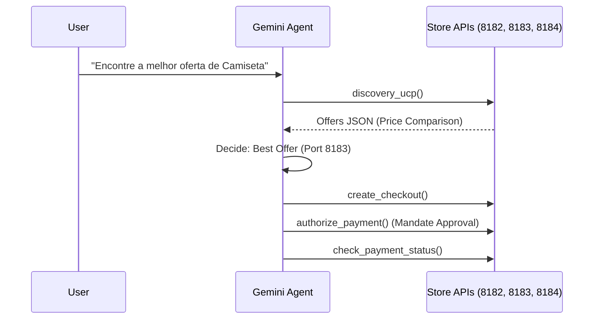

# Flux Hub: Autonomous UCP Agent for Agentic Commerce 🚀

**Flux Hub** é uma prova de conceito de um orquestrador de compras autônomo baseado no **Universal Commerce Protocol (UCP)**. Utilizando o modelo **Gemini 2.0 Flash**, o agente é capaz de descobrir mercantes, comparar ofertas e executar pagamentos usando mandatos pré-aprovados.

## 🌟 Diferenciais Técnicos
- **Autonomous Discovery:** Varredura dinâmica de endpoints `.well-known/ucp`.
- **Decision Making:** Lógica de comparação de preços entre múltiplos fornecedores.
- **Mandate-Based Payment:** Execução de transações financeiras automáticas baseadas em limites de crédito (Mandatos).
- **Multi-turn Tool Use:** Orquestração de chamadas de API sequenciais (Discovery -> Checkout -> Pay -> Status).

## 🏗️ Arquitetura
O sistema é dividido em dois domínios:
1. **The Hub (Agent):** O cérebro que processa linguagem natural e gerencia ferramentas (tools).
2. **The Ecosystem (Merchants):** Simuladores de APIs de e-commerce que expõem capacidades via UCP.

    FluxHub-->>User: Final Transaction Report (PAID)
